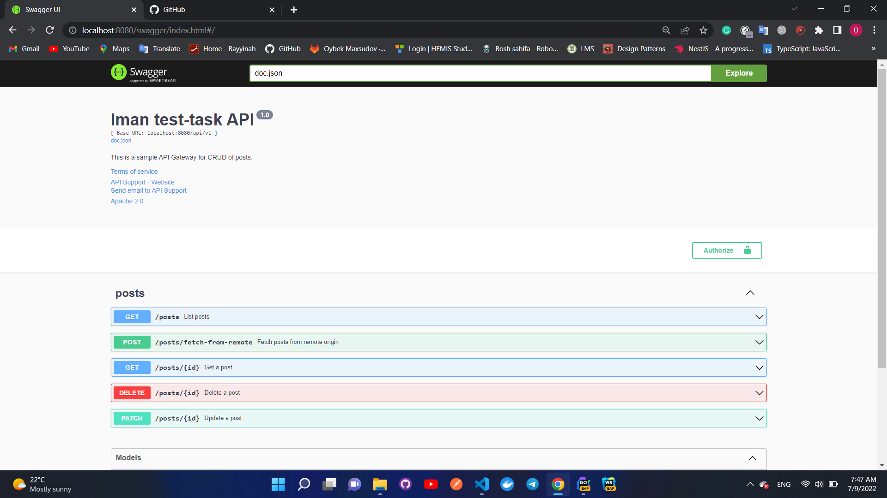

# IMAN test-task API Gateway
### This service contains following endpoints:
+ [POST] /posts/fetch-from-remote - getting posts from remote origin
+ [GET] /posts - getting all stored posts
+ [GET] /posts/:id - getting a post by post_id
+ [PATCH] /posts/:id - partial updating a post
+ [DELETE] /posts/:id - deleting a post by post_id

Requests from user are handled here and delivered to post_crud and posts services by gRPC connection.

Running on port ":8080"

It also contains Swagger documentation running on {HOST}:8080/swagger/index.html.

